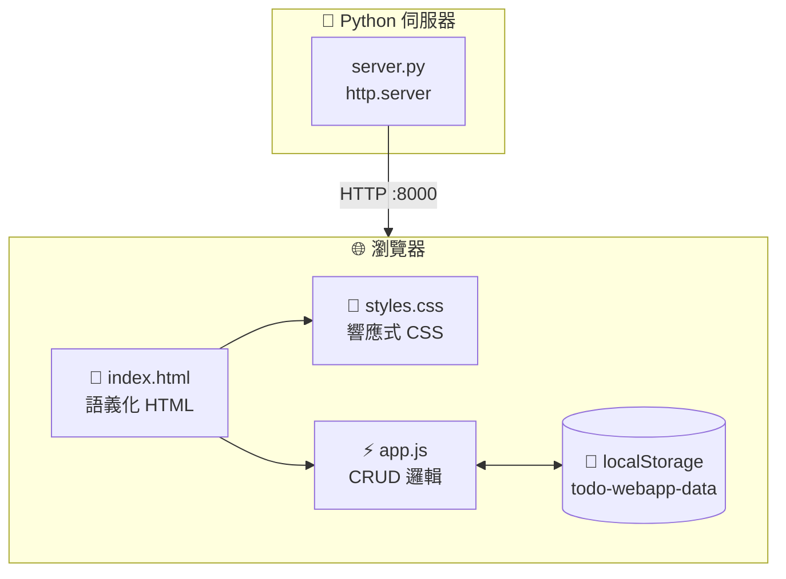
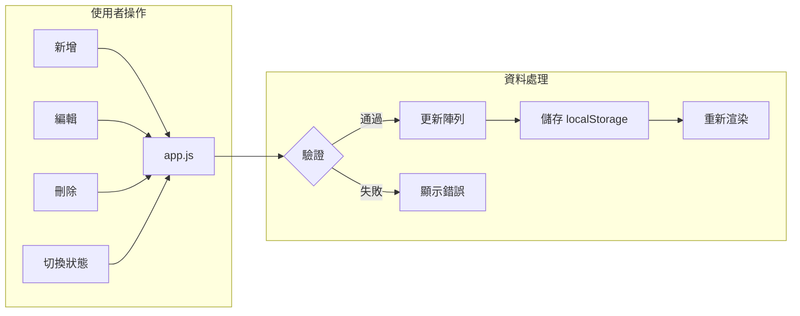
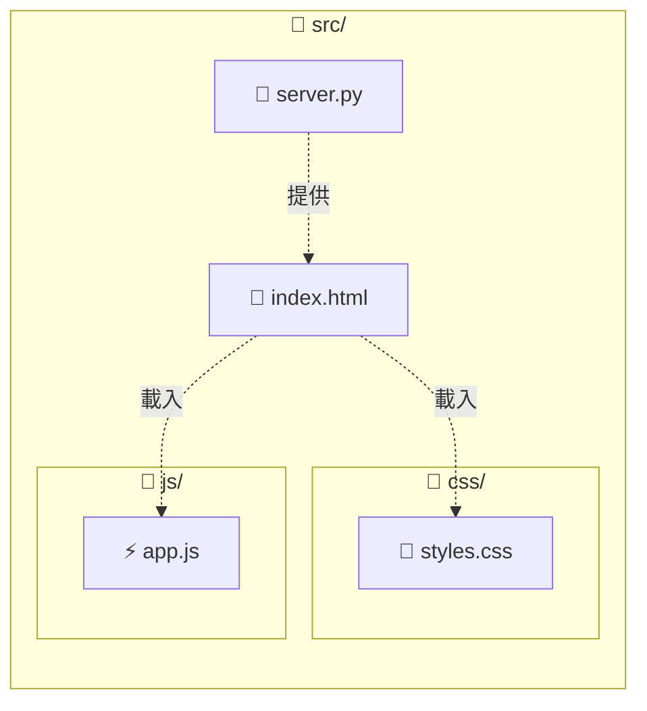
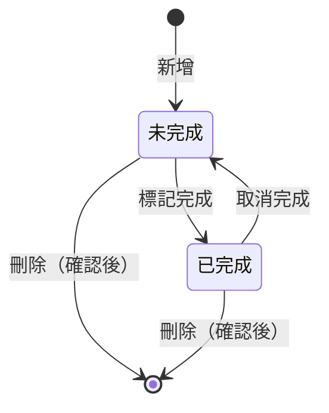

# SpecKit 專案

SpecKit 是一套功能規格與實作工作流程系統，透過 AI 代理程式 (Agent) 協助將自然語言描述轉換為結構化的規格文件、技術計畫與可執行任務。

## 快速開始

```bash
# 建立新功能規格
/speckit.specify 我想要建立一個使用者登入功能

# 釐清規格需求
/speckit.clarify

# 建立技術計畫
/speckit.plan 我使用 Python + FastAPI

# 產生任務清單
/speckit.tasks

# 執行實作
/speckit.implement
```

## 工作流程

```
使用者描述 → specify → clarify → plan → tasks → implement
                ↓         ↓        ↓       ↓
             spec.md   (更新)   plan.md  tasks.md
```

## 代理程式清單

| 代理程式 | 說明 |
|----------|------|
| `speckit.specify` | 從自然語言描述建立功能規格 |
| `speckit.clarify` | 透過問答釐清規格中的模糊之處 |
| `speckit.constitution` | 管理專案憲章與治理原則 |
| `speckit.plan` | 產生技術實作計畫 |
| `speckit.tasks` | 將計畫分解為可執行任務 |
| `speckit.checklist` | 建立需求品質檢核清單 |
| `speckit.analyze` | 執行跨文件一致性分析 |
| `speckit.implement` | 依任務清單執行實作 |
| `speckit.taskstoissues` | 將任務轉換為 GitHub Issue |

---

## 術語對照表

本專案使用以下中英術語對照，所有文件翻譯皆依此標準：

| 英文 | 繁體中文 | 說明 |
|------|----------|------|
| Feature | 功能 | 待開發的產品功能 |
| Specification / Spec | 規格 | 功能的詳細描述文件 |
| Requirement | 需求 | 系統應具備的能力 |
| Functional Requirement | 功能性需求 | 系統必須執行的行為 |
| Non-Functional Requirement | 非功能性需求 | 效能、安全性等品質屬性 |
| User Story | 使用者故事 | 以使用者角度描述的需求 |
| Acceptance Criteria | 驗收條件 | 確認需求完成的標準 |
| Acceptance Scenario | 驗收情境 | 具體的驗收測試案例 |
| Task | 任務 | 可執行的工作項目 |
| Checklist | 檢核清單 | 品質驗證項目列表 |
| Constitution | 憲章 | 專案的核心原則與規範 |
| Principle | 原則 | 不可妥協的規範條目 |
| Plan | 計畫 | 技術實作規劃文件 |
| Implementation | 實作 | 程式碼開發工作 |
| Phase | 階段 | 工作流程的分段 |
| Dependency | 相依性 | 任務間的先後關係 |
| Edge Case | 邊界情境 | 非典型的使用情況 |
| Clarification | 釐清 | 解決模糊或不明確之處 |
| Ambiguity | 模糊性 | 定義不清的狀態 |
| Coverage | 涵蓋率 | 需求被任務覆蓋的程度 |
| Severity | 嚴重程度 | 問題的影響等級 |
| Priority | 優先順序 | 工作的重要性排序 |
| Agent | 代理程式 | 執行特定任務的 AI 程式 |
| Workflow | 工作流程 | 任務執行的順序與流程 |
| Template | 範本 | 標準化的文件格式 |
| Artifact | 產出文件 | 工作流程產生的檔案 |
| Contract | 契約 | API 介面定義 |
| Data Model | 資料模型 | 系統的資料結構定義 |
| Entity | 實體 | 資料模型中的物件類型 |
| Endpoint | 端點 | API 的存取位址 |
| API | 應用程式介面 (API) | 程式間的溝通介面 |
| TDD | 測試驅動開發 (TDD) | 先寫測試再寫程式的方法 |
| MVP | 最小可行產品 (MVP) | 具備核心功能的初版產品 |
| JSON | JSON | 資料交換格式 |
| CLI | 命令列介面 (CLI) | 文字指令操作介面 |
| Repository | 儲存庫 | 版本控制的程式碼庫 |
| Branch | 分支 | 版本控制的開發線 |
| Parallel | 平行 | 可同時執行的任務 |
| Sequential | 循序 | 需依序執行的任務 |
| Governance | 治理 | 專案管理與決策機制 |
| Validation | 驗證 | 確認正確性的檢查 |
| Setup | 設置 | 初始化配置工作 |
| Polish | 收尾 | 最後的優化與調整 |
| Foundational | 基礎建設 | 其他工作依賴的基礎 |
| Checkpoint | 檢查點 | 階段性驗證時機 |
| Handoff | 移交 | 將工作交給下一個代理程式 |
| Gate | 關卡 | 必須通過的檢查條件 |
| Rationale | 理由 | 決策的原因說明 |
| Constraint | 約束條件 | 系統必須遵守的限制 |
| Traceability | 可追溯性 | 需求與實作的對應關係 |

---

## 目錄結構

```
.github/
└── agents/                 # 代理程式定義檔
    ├── speckit.analyze.agent.md
    ├── speckit.checklist.agent.md
    ├── speckit.clarify.agent.md
    ├── speckit.constitution.agent.md
    ├── speckit.implement.agent.md
    ├── speckit.plan.agent.md
    ├── speckit.specify.agent.md
    ├── speckit.tasks.agent.md
    └── speckit.taskstoissues.agent.md

.specify/
├── memory/
│   └── constitution.md     # 專案憲章
├── scripts/
│   └── bash/               # Shell 腳本
└── templates/              # 文件範本
    ├── agent-file-template.md
    ├── checklist-template.md
    ├── plan-template.md
    ├── spec-template.md
    └── tasks-template.md

specs/                      # 功能規格目錄 (依分支建立)
└── [###-feature-name]/
    ├── spec.md
    ├── plan.md
    ├── tasks.md
    └── checklists/
```

---

## 待辦事項網頁應用 - 技術架構

此專案包含一個待辦事項網頁應用（功能分支：`001-todo-webapp`），採用以下技術架構：

### 系統架構圖



### 資料流程圖



### 原始碼結構



### Todo 實體狀態圖



---

## 授權

[依專案需求填寫]
