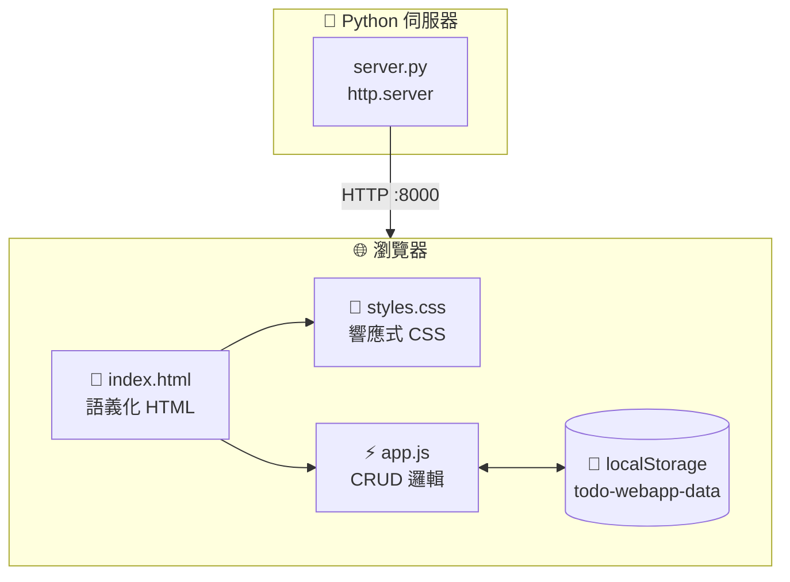
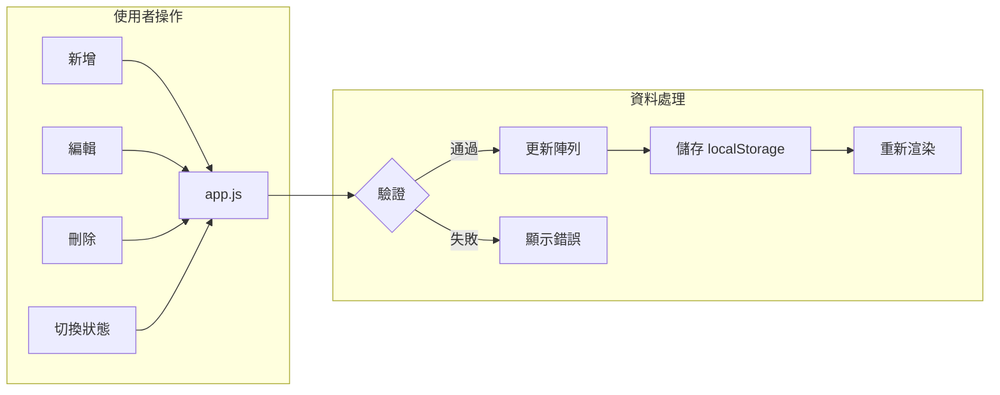
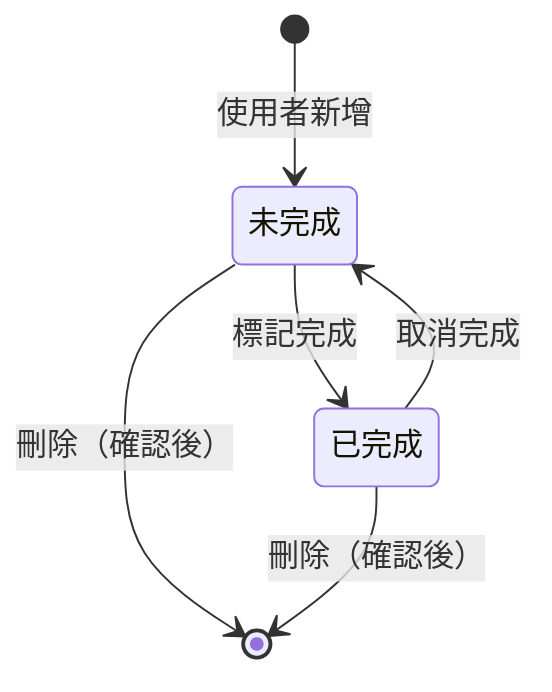

# 📝 待辦事項網頁應用 (ToDo WebApp)

> 這是一個使用純前端技術（HTML、CSS、JavaScript）打造的待辦事項應用程式，適合作為學習 Spec Kit 的入門範例。

---

## 專案簡介

這是一個功能完整的**待辦事項管理系統**，讓你可以：

- ✅ **新增**待辦事項
- 📋 **查看**所有任務（未完成 / 已完成分類顯示）
- ✏️ **編輯**任務內容
- 🗑️ **刪除**不需要的任務
- ☑️ **標記**任務完成狀態
- 🌙 **深色模式**切換（護眼功能）
- 💾 **自動儲存**到瀏覽器（關閉網頁後資料仍在）

### 特色亮點

| 特色 | 說明 |
|------|------|
| 🎨 現代化介面 | 美觀的卡片式設計，支援深色/淺色模式切換 |
| 📱 響應式設計 | 手機、平板、電腦都能完美顯示 |
| ♿ 無障礙支援 | 符合 WCAG 2.1 AA 標準，支援螢幕閱讀器與鍵盤操作 |
| 🚫 不需後端 | 使用瀏覽器 localStorage 儲存資料，無需設定資料庫 |
| 🐍 簡易伺服器 | 使用 Python 內建模組，一行指令即可啟動 |

---

## 快速開始（5 分鐘上手）

### 步驟一：確認環境

請先確認你的電腦已安裝：

- **Python 3.11 或更新版本**（用於啟動開發伺服器）
- **現代瀏覽器**（Chrome、Firefox、Safari、Edge 任一即可）

> 💡 **如何檢查 Python 版本？**  
> 在終端機輸入：`python --version` 或 `python3 --version`

### 步驟二：下載專案

```bash
# 使用 Git 複製專案
git clone https://github.com/ownway22/toDo-webApp.git

# 進入專案資料夾
cd toDo-webApp
```

### 步驟三：啟動伺服器

```bash
# 進入原始碼目錄
cd src

# 啟動開發伺服器
python server.py
```

你會看到類似這樣的輸出：
```
🚀 待辦事項網頁應用開發伺服器
📁 服務目錄：/path/to/src
🌐 開啟瀏覽器訪問：http://localhost:8000
⏹️  按 Ctrl+C 停止伺服器
```

### 步驟四：開始使用

打開瀏覽器，輸入網址：**http://localhost:8000**

🎉 恭喜！你已經成功運行這個應用程式了！

---

## 專案結構

```
toDo-webApp/
│
├── 📄 README.md              ← 你現在正在閱讀的說明文件
│
├── 📁 src/                   ← 🔥 原始碼（最重要！）
│   ├── index.html           ← 網頁結構（HTML）
│   ├── server.py            ← Python 開發伺服器
│   ├── css/
│   │   └── styles.css       ← 視覺樣式（CSS）
│   └── js/
│       └── app.js           ← 應用邏輯（JavaScript）
│
└── 📁 specs/                 ← 📋 功能規格文件（進階閱讀）
    ├── 001-todo-webapp/     ← 待辦事項核心功能
    └── 002-dark-mode-toggle/← 深色模式功能
```

---

## 核心概念解說

### 1️⃣ 資料儲存方式

本應用使用瀏覽器的 **localStorage** 儲存資料，不需要資料庫！

```javascript
// 儲存資料
localStorage.setItem('todo-webapp-data', JSON.stringify(data));

// 讀取資料
const data = JSON.parse(localStorage.getItem('todo-webapp-data'));
```

> 📚 **什麼是 localStorage？**  
> localStorage 是瀏覽器提供的儲存空間，可以在網頁關閉後保留資料。每個網站最多可儲存約 5MB 的資料。

### 2️⃣ 待辦事項資料結構

每個待辦事項是一個 JavaScript 物件：

```javascript
{
  id: "1706515200000",     // 唯一識別碼（使用時間戳記產生）
  text: "購買牛奶",         // 待辦內容（最多 100 字元）
  completed: false,        // 是否完成
  createdAt: 1706515200000 // 建立時間（Unix 毫秒時間戳記）
}
```

### 3️⃣ 程式架構模式

本專案使用 **MVC（Model-View-Controller）** 概念：

```
┌──────────────┐     ┌──────────────┐     ┌──────────────┐
│    Model     │     │     View     │     │  Controller  │
│  TodoStore   │◄───►│  HTML/CSS    │◄───►│   app.js     │
│  (資料管理)   │     │  (視覺呈現)   │     │  (事件處理)   │
└──────────────┘     └──────────────┘     └──────────────┘
```

---

## 功能操作說明

### 新增待辦事項
1. 在輸入框輸入任務內容
2. 按下「新增」按鈕或按 **Enter 鍵**
3. 新項目會出現在「未完成」清單最上方

### 標記完成/未完成
- 點擊項目左側的 **核取方塊**
- 完成的項目會移到「已完成」區塊，並顯示刪除線

### 編輯項目
1. 點擊項目右側的 **「編輯」按鈕**
2. 修改內容後按 **Enter** 儲存
3. 按 **Esc** 取消編輯

### 刪除項目
1. 點擊項目右側的 **「刪除」按鈕**
2. 確認對話框會詢問「確認刪除？」
3. 點擊確認後項目會被移除

### 深色模式切換
- 點擊標題區右上角的 **🌙/☀️ 按鈕**
- 系統會記住你的偏好設定

---

## 技術架構

### 系統架構圖



### 資料流程圖



### Todo 生命週期



---

## 📋 關於 Spec Kit 框架

本專案使用 **SpecKit** 工作流程開發，這是一套 AI 輔助的軟體規格系統。

### SpecKit 工作流程

```
使用者描述 → specify → clarify → plan → tasks → implement
                ↓         ↓        ↓       ↓
             spec.md   (更新)   plan.md  tasks.md
```

### 規格文件位置

- `specs/001-todo-webapp/` - 待辦事項核心功能規格
- `specs/002-dark-mode-toggle/` - 深色模式功能規格

> 💡 閱讀這些規格文件可以學習「如何將想法轉換為技術實作」的思考過程。

---

## 📄 授權條款

本專案採用 MIT 授權條款 - 詳見 [LICENSE](LICENSE) 檔案

---

<div align="center">

**Happy Coding! 🎉**

Made with ❤️ for students

</div>
